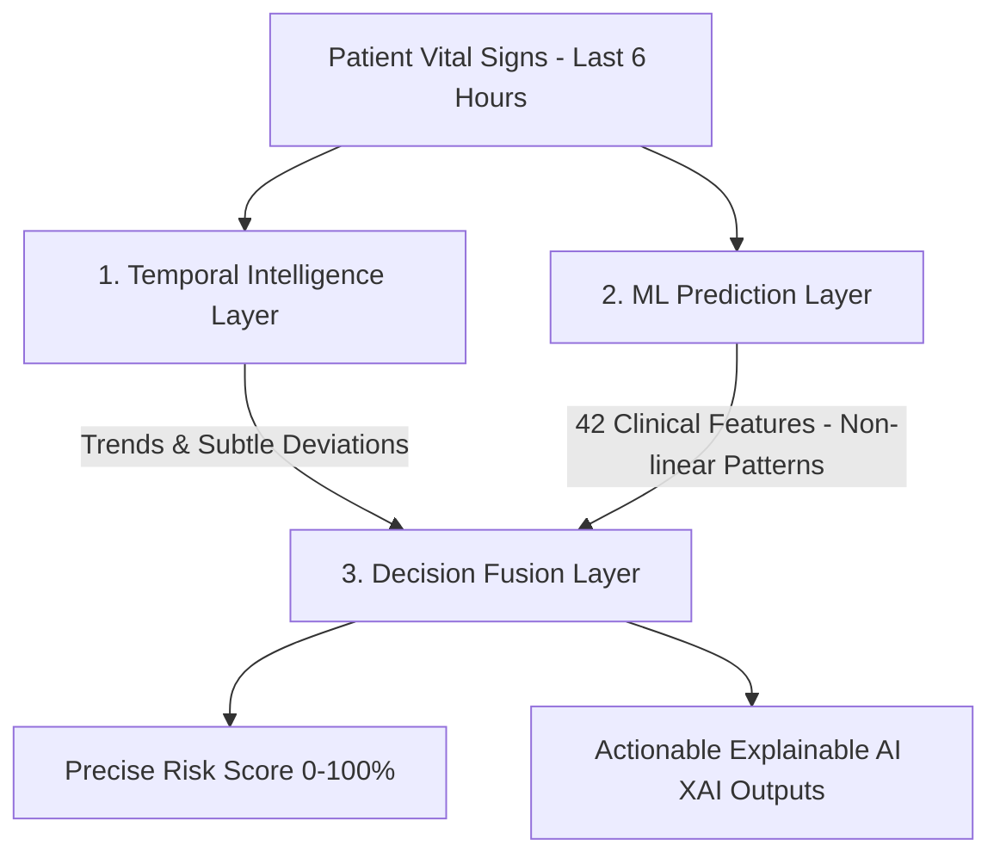

```markdown
#  Patient Deterioration Prediction Using Hybrid 3-Layer AI Architecture

[](https://huggingface.co/spaces/EngReem85/patient-deterioration-prediction)
[](https://github.com/EngReem85/patient-deterioration-prediction/actions)

##  Live Demo
**Try the application now:** [https://huggingface.co/spaces/EngReem85/patient-deterioration-prediction](https://huggingface.co/spaces/EngReem85/patient-deterioration-prediction)

An advanced clinical decision support system designed to predict patient health deterioration proactively before it reaches a critical stage. Developed as an innovative solution during the **Newtech Hackathon** (AI Track).

---

##  Clinical Problem
Hospitals face a major challenge in detecting early signs of clinical deterioration in hospitalized patients. Vital signs often appear within normal ranges superficially, while subtle, non-linear temporal trends precede actual degradation. Traditional threshold-based monitoring systems fail to capture these hidden patterns, leading to delayed medical interventions. This system bridges the gap by providing proactive, explainable, and time-aware risk alerts.

##  The Solution: Hybrid 3-Layer Architecture
The system utilizes a hybrid engineering architecture that merges rule-based clinical expertise with state-of-the-art machine learning models across three specific layers:



### 1. Temporal Intelligence Layer
A clinical knowledge-driven, rule-based expert system that processes a 6-hour sliding window of patient vital signs to compute rates of change, directional trends, and early deviations. This layer captures subtle patterns that traditional threshold-based systems miss.

### 2. ML Prediction Layer
Handles comprehensive data exploration, preprocessing, and feature engineering to analyze **42 clinical features** (21 baseline + 21 temporal trend features). It extracts non-linear interactions using ensemble models like `XGBoost` and `Random Forest`, optimized for high recall to minimize false negatives.

### 3. Decision Fusion & Interface Layer
Intelligently merges the predictions from both the rule-based and machine learning components. It outputs a unified risk score (0-100%), provides plain-text clinical explanations (XAI), and serves the complete user interface deployed on Hugging Face Spaces with Gradio.

---

##  Technical Highlights

- **Data Reliability:** Developed and validated using multivariate patient vital signs time-series data for approximately 10,000 clinical cases from Kaggle.

- **Handling Imbalanced Data:** Applied `SMOTE` (Synthetic Minority Over-sampling Technique) to generate smart synthetic risk cases, preventing model bias towards the majority stable class and ensuring critical deterioration detection accuracy.

- **Clinical Evaluation Metrics:** Rather than general accuracy, model selection was strictly optimized for maximum `AUC-ROC` score and a minimal **False Negative** rate to ensure no high-risk patient is missed.

- **Explainable AI (XAI):** Converts numeric model probabilities into plain-language clinical insights, detailing the specific vital sign drivers behind the alert and the timeframe of the observed deterioration.

---

##  Tech Stack

- **Programming & Notebooks:** Python, Google Colab
- **Machine Learning & Data Science:** Pandas, NumPy, Scikit-learn, Imbalanced-learn (SMOTE), XGBoost
- **UI Framework:** Gradio
- **DevOps & MLOps:** GitHub Actions

---

##  MLOps & Deployment Pipeline

This repository is fully automated using a **GitHub Actions Workflow**. Whenever code is pushed to the `main` branch, the pipeline automatically synchronizes the code repository directly with **Hugging Face Spaces**. This ensures continuous integration and seamless deployment without manual overhead.

---

##  How to Run Locally

1. Clone the repository:
```bash
git clone https://github.com/EngReem85/patient-deterioration-prediction.git
cd patient-deterioration-prediction
```

2. Install the required dependencies:
```bash
pip install -r requirements.txt
```

3. Run the interface application:
```bash
python app.py
```

4. Open your browser and go to:
```
http://127.0.0.1:7860
```

---

## 📁 Project Structure

```
patient-deterioration-prediction/
│
├── app.py                      # Gradio web interface
├── train.py                    # Model training pipeline
├── model_artifacts(1).pkl     # Trained model artifact
├── requirements.txt            # Python dependencies
├── README.md                   # Project documentation
│
├── .github/
│   └── workflows/
│       └── main.yml           # GitHub Actions MLOps pipeline
│
└── screenshots/                # UI screenshots
    ├── main_ui.png
    └── prediction_example.png
```

---

## 🤝 Team Project

Developed with synergy and technical integration by our team at the **Newtech Hackathon** to advance digital patient safety.

---


**Made with ❤️ for better patient outcomes**
```
